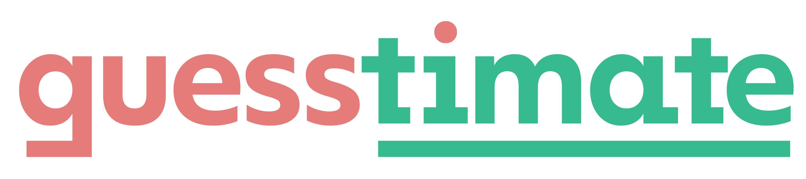
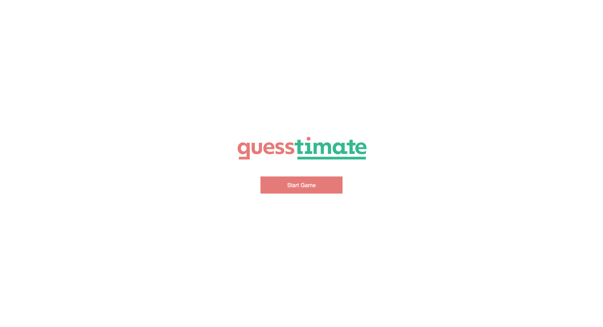
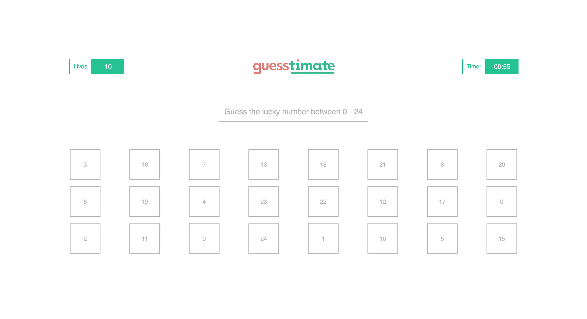

# Overview
#### [Guesstimate](https://github.com/divinestylus/guesstimate) - A Guess Game App
###### Guesstimate is a mini web guess game application. The goal of the game is to guess the lucky number between 0 and 24. You have 10 tries and one minute to do so.

## Tech Stack
#### HTML | CSS | JavaScript | API - [https://forum.freecodecamp.org/t/free-api-inspirational-quotes-json-with-code-examples/311373](https://forum.freecodecamp.org/t/free-api-inspirational-quotes-json-with-code-examples/311373)

###### &copy; 2023 | Designed & Developed by [Sam B. Morris](https://github.com/divinestylus)
